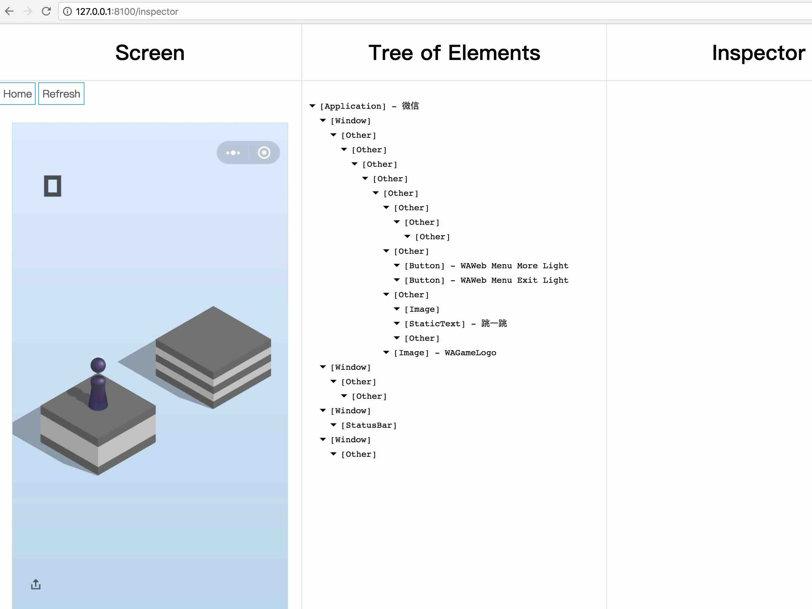

# 微信跳一跳全自动化“辅助”工具ios版

这段时间微信跳一跳这个小游戏挺火的，各种“辅助工具”也是层出不穷...


那我也来写一个好啦...现已实现完全自动化. ps: 这是外挂，好孩子不要用.....


先感谢一下这位[老哥](https://zhuanlan.zhihu.com/p/32452473), 他应该是第一个这么做的人, 后续的大致都是由这个思路来的.


## 需要环境
(括号里是我使用的版本, 别的版本未经实验不保证成功, 机型: Iphone7)
- Nodejs (v9.3.0)
- NPM (v5.5.1)
- xcode (v9.2)
- WebDriverAgent


## 准备步骤
前两个就不说了，安装Node和NPM推荐使用[NVM](https://github.com/creationix/nvm)


[WebDriverAgent](https://github.com/facebook/WebDriverAgent)是Facebook出的一套iOS的WebDriver工具, 简单来说可以实时把连接的iOS设备状态模拟到一个Web服务器上, 提供一系列调试接口. 更多信息可以在项目主页里看到, 安装过程为:
1. 克隆到本地
```
git clone https://github.com/facebook/WebDriverAgent.git
```
2. 进入文件夹运行脚本
```
./Scripts/bootstrap.sh
```
脚本运行需要[`Carthage`](https://github.com/Carthage/Carthage)和`npm`, 这两个都是用来安装WDA的依赖包的, 看样子是依赖了node和iOS两种生态, 分别负责原生和Web两个模块, 安装`carthage`直接 `brew install carthage`.


3. 用Xcode打开文件夹里的 `WebDriverAgent.xcodeproj`


4. 如果是真机调试, 连接iOS设备后需要iOS开发者签名, 这一部分不做说明, 跟正常iOS开发一样, 需要注意的是, 要对项目内`WebDriverAgentLib`, `WebDriverRunner`, `integrationApp`都需填入开发者签名. 提供一个很好的中文参考文档[iOS 真机如何安装 WebDriverAgent](https://testerhome.com/topics/7220). 还有就是国行的iOS设备需要端口转发才能访问, 需要将手机的端口转发到Mac上. 使用工具`imobiledevice`即可
```
$ brew install libimobiledevice
$ iproxy 8100 8100
```


运行WDA的test: [Product] -> [test], 或者`CMD + U`. 之后iOS设备会安装一个WebDriverAgent App, 自动打开黑屏然后自动退出, 期间不用管它, 如果迟迟不退出, 有可能是失败了, 断开设备重连再运行test(还是失败可以删除App再试一试). 在App退出之后就可以正确运行js脚本了.


然后在项目根目录安装npm依赖, 运行:
```
npm i
```


## 运行脚本
WDA启动之后, 可以尝试打开`http://127.0.0.1:8100/status`查看设备状态, 正常情况会有JSON返回, 打开`http://127.0.0.1:8100/inspector`会是这样



其他API看[这里](https://github.com/facebook/WebDriverAgent/wiki/Queries), 其实这里的Wiki也不全, 我看过WDA源码之后找到这个[文件](https://github.com/facebook/WebDriverAgent/blob/master/WebDriverAgentLib/Commands/FBElementCommands.m#L60), 里面应该是完整的API代码, 比较语义化, 应该能看得懂(主要会用到`screenshot`和`touchAndHold`的API).


一切正常之后, 打开微信跳一跳, 开始游戏后运行
```
npm start
```


---

目前的精度还不能100%都完美落在中心点, 大概多次之后会有一点点误差, 后续会继续改进算法. (Ps: 欢迎和我谈论改进, 乐趣在开发过程, 所以我自己也就几百分就没挂着了, 不知道后面几万分会怎么样...)


先写这么多, 详细的算法介绍接下来有时间就写, 欢迎提issue或直接找我.
